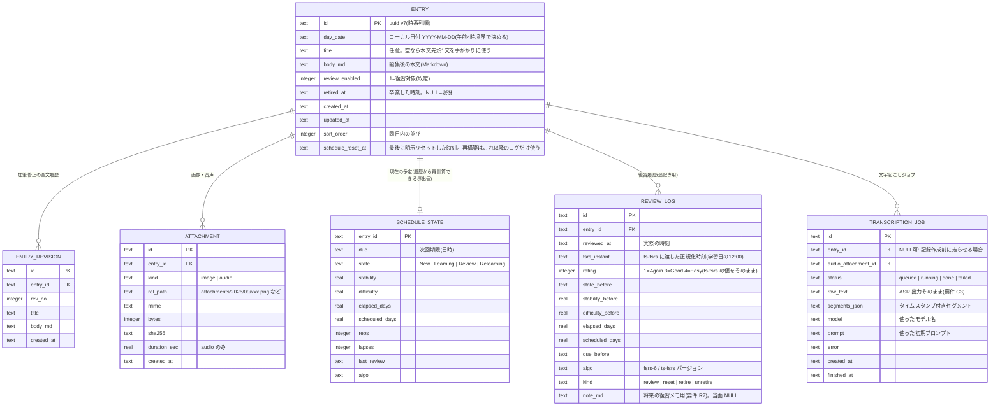

# 設計01：全体構成（v1.0）

- 作成日：2026-09-15
- 状態：技術検証3件（`docs/research/05-spike-recorder.md`、`05-spike-fsrs.md`、`06-spike-whisper.md`）の結果を反映済み。実装の基準文書。
- 前提となる要件：`docs/requirements/01-needs-and-requirements-draft.md`（v0.2、判断10件確定済み、日本語メイン要件 §3.7を含む）。

## 1. 一言でいうと

Bun上で動く1プロセスのローカルWebサーバー（Hono）が、SQLiteと添付ファイルを管理し、ブラウザの単一ページアプリ（Preact）にJSON APIを提供する。音声認識はwhisper.cppのコマンドをサブプロセスとして呼ぶ。スケジューリングはts-fsrs。すべてローカルで完結し、ネットワークは使わない。

## 2. 技術選定（確定分）

| 層 | 選定 | 理由 |
|---|---|---|
| 実行系 | Bun 1.2 | 導入済み。SQLite（`bun:sqlite`）内蔵。TypeScriptをそのまま実行できる。 |
| HTTP | Hono | 軽量。静的配信・SSE（サーバー送信イベント）・multipartに対応。 |
| フロント | Preact + TypeScript + Vite | Reactと同じ書き方で小さい。IME対応の入力制御を素直に書ける。Svelte 5は構文が新しく実装者（サブエージェント）の誤りが増えるため避ける。 |
| DB | SQLite（WALモード）+自前マイグレーション（連番SQLファイル） | 単一ファイル。ORMは入れない（クエリが少なく、可搬性を優先）。 |
| 全文検索 | SQLite FTS5 trigram | 日本語に単語境界がないためtrigram。司令塔が確認済み：Bun 1.2同梱のSQLite 3.51.0でFTS5 trigramが動く（2026-09-15）。 |
| 音声認識 | whisper.cpp 1.9.4（Homebrew）の `whisper-cli`、モデルggml-large-v3-turbo（q5_0量子化版でも可） | 決定済み。呼び出しは薄い層に閉じ込める（要件N4）。検証済み（`06-spike-whisper.md`）：Homebrew版はCore ML非対応だがMetalだけで実時間の12〜14倍速。**`-nt`（タイムスタンプ省略）は絶対に付けない**（デコードが変わり文が丸ごと落ちる。実測で文字誤り率49.6% → 外すと8.8%）。`-l ja` 必須（自動判定は英語に誤判定）。 |
| スケジューリング | ts-fsrs 5.4.2（FSRS-6） | 決定済み。検証済み（`docs/research/05-spike-fsrs.md`）：決めた設定はすべてそのまま実現でき、履歴からの再構築は「評価」と「復習時刻」の2列だけで完全一致する。 |
| 録音 | ブラウザWeb Audio API（AudioWorklet）で16kHzモノラルWAVを生成 | ffmpeg不要。Chrome 152実機で検証済み（`docs/research/05-spike-recorder.md`）。Safariは未確認。 |

## 3. ディレクトリ構成（案）

```
spaced-repetition-with-whisper/
  package.json            # ワークスペースのルート（bun）
  server/
    index.ts              # 起動。ポート、データディレクトリの解決
    app.ts                # Hono アプリの組み立て
    routes/               # HTTP ルート（薄く。ロジックは services へ）
    services/
      entries.ts          # 記録の作成・更新・履歴
      reviews.ts          # 復習キューの取り出し、評価の記録
      scheduler.ts        # ts-fsrs の薄いラッパー（要件 S1〜S7）
      transcribe.ts       # 文字起こしジョブの管理（キュー、進捗、失敗保持）
      exporter.ts         # Markdown / JSON 書き出し
      search.ts
    adapters/             # 外界との境界。Tauri 化のときにここだけ差し替える（要件 N4）
      asr-whisper-cli.ts  # whisper-cli をサブプロセスで呼ぶ
      files.ts            # 添付・音声ファイルの読み書き
      clock.ts            # 現在時刻と「一日の境界（午前 4 時）」の計算
    db/
      connection.ts
      migrations/0001_init.sql ...
      queries/            # SQL をまとめる
  web/
    index.html
    src/
      main.tsx
      api.ts              # fetch のラッパー
      pages/ Today.tsx Review.tsx Settings.tsx Search.tsx
      components/ Recorder.tsx EntryEditor.tsx EntryCard.tsx ReviewCard.tsx Attachments.tsx
      audio/ recorder-worklet.js wav-encoder.ts
      i18n/ ja.ts         # 文言はすべてここに集約（要件 J1）
  docs/                   # 要件・調査・設計
  spikes/                 # 技術検証（本体からは参照しない）
```

## 4. データの置き場

- 既定のデータディレクトリ：リポジトリ直下の `data/`（git管理外。`.gitignore` 済み。環境変数 `MNEMORIZE_DATA_DIR` で変更可）。
  2026-09-15に既定を `~/Library/Application Support/mnemorize/` から変更した。理由：ネイティブアプリではなくローカル起動のWebアプリなので、作業ディレクトリに集約する。
  - `mnemorize.sqlite`（正本）
  - `attachments/YYYY/MM/<uuid>.<ext>`（画像）
  - `audio/YYYY/MM/<uuid>.wav`（録音。要件D8で保存すると決定）
  - `snapshots/mnemorize-YYYYMMDD.sqlite`（日次スナップショット。要件P3）
  - `export/`（Markdown / JSON書き出し先の既定）
- 設定はDBの `settings` テーブル（キー・値）。モデルのパス、専門用語リスト、1日の上限、境界時刻など。

## 5. データモデル

`docs/research/03-tech-stack.md` の素案をもとに、確定した判断を反映して調整した。



REVIEW_LOGの列は検証（`05-spike-fsrs.md`）で確定した：再構築に必須なのは `rating` と `reviewed_at` の2列。`*_before` 列は表示・診断用の冗長列。`elapsed_days` はts-fsrs 6.0で削除予定の項目なので保存の前提にしない（列は残してよいが再構築には使わない）。

スケジューラ実装で守る規約（検証で判明した落とし穴への対策）：
- **復習時刻の正規化**：ts-fsrsは経過日数をUTCの暦日で数えるため、日本時間では日付の境目が09:00になり「昨夜22:00 → 今朝07:00」が経過0日と扱われて間隔が縮む（実測：9日のはずが3日）。対策として、ts-fsrsに渡す復習時刻は「その学習日（午前4時境界で決めた日付）の12:00ローカル」に正規化する。REVIEW_LOGには実時刻 `reviewed_at` と正規化後 `fsrs_instant` の両方を保存する。
- **初回期限**：新規状態ではts-fsrsは `due` を読まないので、作成時に `due` を「翌日の4:00」に自分で書いてよい。
- **fuzzのseed**：既定seed（復習時刻＋回数＋記憶状態から決まる決定的な値）を使う。`GenSeedStrategyWithCardId` は再構築時に期限がずれるので使わない。
- **リセット**：`forget(card, now, true)` の結果は新規作成と同一。リセットはFSRSのログ列に混ぜず、ENTRYに `schedule_reset_at` を持ち、再構築ではそれ以降の `kind=review` 行だけを使う。
- **上限365日は不変条件ではない**：実装が評価順を強制するため366〜367日になることがある。「期限は必ず365日以内」を前提にしたコードを書かない。
- **「余裕だった」は強く効く**：3回で上限間隔に達する。ボタンの説明文で「次は数か月〜1年先になります」と伝える。
- **負荷の見込み**：毎日2件作成・全部「思い出せた」の90日シミュレーションで1日平均5.9件、10件超は90日中3日のみ。上限10件はほぼ発動しない安全弁。

設計上の決め：
- 記録の作成時にSCHEDULE_STATEを作り、`due` は「作成日の翌日の境界時刻」にする（要件S5）。
- 復習は「REVIEW_LOGに1行追記 → SCHEDULE_STATEを更新」を1トランザクションで行う。
- 明示リセット（要件S4）はENTRYの `schedule_reset_at` を更新し、REVIEW_LOGに `kind=reset` を記録（監査用。再構築では無視）し、SCHEDULE_STATEを新規状態＋翌日期限に戻す。過去の行は消さない。
- 卒業（要件R6）は `retired_at` を立て、`kind=retire` を追記。キューから外れるが日付ビューには残る。
- 全文検索用にFTS5仮想テーブル `entry_fts(title, body_md, raw_text)` をトリガーで同期する。

## 6. HTTP API（案）

すべて `/api` 配下、JSON。日付は `YYYY-MM-DD`、時刻はISO 8601（ローカルタイムゾーンのオフセット付き）。

| メソッドとパス | 役割 |
|---|---|
| `GET /api/days/:date` | その日の記録一覧（添付・予定含む） |
| `GET /api/days?from=&to=` | 期間内の日ごとの件数（カレンダー表示用） |
| `POST /api/entries` | 記録作成 `{day_date, title?, body_md, review_enabled?}` |
| `PATCH /api/entries/:id` | 更新 `{title?, body_md?, review_enabled?, reset_schedule?: boolean}`。更新前の全文をENTRY_REVISIONに積む |
| `GET /api/entries/:id/revisions` | 履歴一覧 |
| `POST /api/entries/:id/retire` / `unretire` | 卒業/取り消し |
| `DELETE /api/entries/:id` | 記録そのものを削除（復習履歴・予定・添付ファイルも一緒に消える） |
| `POST /api/entries/:id/attachments` | 画像追加（multipart） |
| `DELETE /api/attachments/:id` | 添付削除 |
| `GET /files/*` | 添付・音声の配信（データディレクトリ配下のみ） |
| `POST /api/transcriptions` | WAVを受け取りジョブ作成。`{entry_id?}` を付けられる。即座に `{job_id}` を返す |
| `GET /api/transcriptions/:id` | 状態と本文 |
| `GET /api/transcriptions/:id/events` | SSEで進捗と部分結果を配信（要件C2） |
| `POST /api/transcriptions/:id/retry` | 保存済みWAVで再実行（要件C4） |
| `GET /api/reviews/today` | 今日の復習キュー（上限適用後）と、上限で繰り越した件数 |
| `POST /api/reviews` | 評価を記録`{entry_id, rating: 1|3|4}` → 次回期限を返す |
| `GET /api/search?q=` | 全文検索 |
| `GET /api/export/markdown` / `json` | 書き出し（zipまたは指定ディレクトリへの書き込み） |
| `GET/PUT /api/settings` | 設定 |
| `GET /api/health` | whisper-cliとモデルの有無、DBのパスを返す（初回セットアップの案内に使う） |

## 7. 画面（案）

画面は`docs/design/05-ui-grand-design.md`を基準にする。

IMEへの配慮（要件J5）：テキスト入力では `compositionstart`/`compositionend` を監視し、変換中はEnterやCmd+Enterの保存ショートカットを無視する。

## 8. 文字起こしの流れ

録音の実装上の注意（検証 `05-spike-recorder.md` からの引き継ぎ）：AudioContextは `sampleRate: 16000` 指定で作り、実際の値が違えば線形補間でリサンプリングする。AudioWorkletNodeは出力先（destination）に繋がっていないと処理関数が呼ばれないので、ゲイン0のGainNodeを経由して繋ぐ。Workletからメインスレッドへ渡すFloat32Arrayは毎回コピーする。AudioContextの生成とresumeはクリック処理の中で行う。停止時はトラック停止・ノード切断・AudioContext.close()を確実に行う（マイク使用中の表示が消えない不具合を防ぐ）。検証コードは `spikes/recorder/` にあり、本番の `web/src/audio/` はこれを土台にする。

1. ブラウザ：録音停止 → 16kHzモノラル16bit WAVを生成 → `POST /api/transcriptions`。
2. サーバー：WAVを `audio/YYYY/MM/<uuid>.wav` に保存しATTACHMENTとTRANSCRIPTION_JOB（queued）を作成。ジョブキューは1並列（M4でも同時実行すると遅くなるため）。
3. アダプタ `asr-whisper-cli.ts`：次のコマンドをサブプロセス起動する。
   ```
   whisper-cli -m <モデルパス> -l ja -fa --prompt "<日本語プロンプト＋用語>" -oj -of <出力パス(拡張子なし)> <wav>
   ```
   - `-nt` は付けない（上記）。`-fa`（flash attention）は速度改善が確認済み。スレッド数は既定のまま。
   - 標準出力にはセグメントごとに `[00:00:00.000 --> 00:00:05.120]  本文` の形で行が出るので、行単位で読んで部分結果をSSEへ流す。
   - 完了後、`-oj` が書いた `<出力パス>.json` の `transcription[].text` と `timestamps`/`offsets` を読み、テキストを結合してraw_textに、配列をsegments_jsonに入れる。
   - `whisper-server` は使わない（常駐プロセスとポートの管理が増える割に、モデル読み込みの節約は数秒で、部分結果が取れない）。将来Tauri化するときはwhisper-rsに置き換えるが、`-nt` 相当の `no_timestamps` をtrueにしない点は同じ。
4. 完了：raw_textとsegmentsを保存。無音では「ご視聴ありがとうございました」や英語の"you"が出ることを実測しており（`--no-speech-thold` を上げても抑制されない）、定型句リスト（設定で編集可。初期値：「ご視聴ありがとうございました」「チャンネル登録」「you」「Thank you.」）に一致するセグメントは除去し、ジョブに警告フラグを立てる（要件J4）。先頭・末尾の無音はブラウザ側でRMS（音量の実効値）しきい値により切り落としてから送る。
   初期プロンプトの効果は「英語の専門用語をラテン文字で出す」方向には効いたが句読点には効かなかった。プロンプトは設定の用語リストを主体にし、長い例文にはしない（長いプロンプトはハルシネーションの原因になる）。
5. 記録がまだ無ければENTRYを作成してbody_mdにraw_textを入れる。既存記録に付けた場合は末尾に追記。

## 9. 復習キューの取り出し

- 「今日」の窓：境界時刻4:00を使い、`now` が4:00より前なら前日扱い。窓は `[今日 4:00, 翌日 4:00)`。
- 対象：`review_enabled=1 AND retired_at IS NULL AND due < 窓の終わり`。
- 並び：`due` の古い順（＝期限超過が長い順）。上限N件（既定10）で切り、残りは繰り越し件数として返す。
- 評価後：ts-fsrsで次回を計算し、REVIEW_LOG追記とSCHEDULE_STATE更新。

## 10. 書き出し

- Markdown：`export/YYYY/YYYY-MM-DD.md`。1日1ファイル。各記録は `## タイトル` の節、frontmatterに日付。記録ごとの予定と履歴の要約は節末にHTMLコメントかYAMLブロックで添える。画像は相対パスでリンク（`export/attachments/` にコピー）。
- JSON：全テーブルをそのまま1ファイルに。将来の取り込み（要件P4）の正本形式。

## 11. 実装の段階分け（案）

| 段階 | 内容 | 完了の目安 |
|---|---|---|
| 0 | リポジトリ骨格、Bunワークスペース、DBマイグレーション、`/api/health` | `bun dev` で空の「今日」画面が出る |
| 1 | 記録の手入力CRUD、日付移動、加筆履歴 | テキストだけで毎日使える |
| 2 | 録音 → 文字起こし → 記録化（SSE進捗、再試行） | 音声で記録できる |
| 3 | 画像添付 | |
| 4 | スケジューラと復習画面、卒業、リセット | 毎日の復習が回る（ここで実利用開始） |
| 5 | 書き出し、スナップショット、設定画面 | データが外に出せる |
| 6 | 検索、細部の磨き込み | |

段階1と4を先に通すと、音声なしでも運用が始められる。段階2は検証結果次第で並行して進める。

## 12. 未決・検証待ちの一覧

- 実際の人の声での精度（検証は合成音声のみ。実利用開始後に体感で判断し、不満ならq8_0やQwen3-ASRを試す）。
- 3分程度の長い音声での挙動（検証は70秒まで）。
- AudioWorklet録音のSafari実機確認（Chromeは確認済み。リサンプリング経路は保険として残す）。
