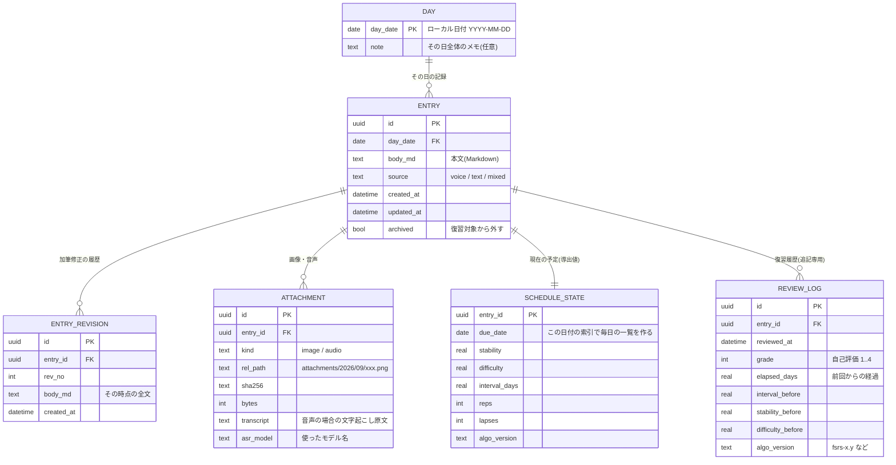

# 調査ノート03：アプリ形態・データ保存・データモデル

- 調査日：2026-09-15
- 作成：Claude Codeのサブエージェント（Opus）による調査を、司令塔（Fable）が保存。
- 前提：個人用ローカルアプリ。音声（ローカルWhisper）・手入力・画像で「今日やったこと」を記録し、間隔反復で毎日再提示する。フラッシュカードにしない。macOS 26 / M4 / 32GB。Bun 1.2、Node 22、Python 3.10、Rust 1.92あり。将来配布は望ましいが必須ではない。データは年単位で残るので可搬性とバックアップを重視。

## 結論（先に）

推奨は案(B)の変形：Bun + Hono（軽量HTTPフレームワーク）でローカルWebアプリを作り、SQLiteを正本、画像はファイル実体＋DBにパス、WhisperはHomebrewで入れたwhisper.cppをサブプロセス呼び出し、音声はffmpegを使わずブラウザ側で16kHzモノラルWAVを作って渡す。代替は案(C) Tauri 2（配布まで見据えるなら最終形はこちら）。「まず個人利用で最短、後で配布」の経路は現実的。WebフロントエンドとSQLiteスキーマを丸ごと再利用でき、後からTauriの殻をかぶせられる（ただしWhisper呼び出し層は書き直し）。

## 1. アプリ形態の比較

前提として確認できた事実：
- 事実：Homebrewにwhisper.cpp 1.9.4がmacOS 26 arm64のビルド済みバイナリとして存在（ローカルで `brew info` を実行して確認）。ffmpeg 9.0.1も同様に入手可能。
- 事実：whisper.cppのCLI /サーバーは16bit・16kHzのWAVしか受け付けない（[whisper.cpp discussion #1399](https://github.com/ggml-org/whisper.cpp/discussions/1399)、[Simon WillisonのTIL](https://til.simonwillison.net/macos/whisper-cpp)）。
- 事実：Apple SiliconではMetal / Core ML経由で実時間の7〜10倍以上の速度が報告されている（[whisper.cppベンチマーク](https://getspeakup.app/blog/whisper-cpp-benchmark-mac/)）。推論：M4なら2〜3分の音声は数十秒以内。
- 事実：TauriはElectronに対してバンドルが桁違いに小さい（Hello Worldで3.2MB対85MB）（[PkgPulse 2026比較](https://www.pkgpulse.com/guides/electron-vs-tauri-2026)）。
- 事実：Developer IDで外部配布するmacOSアプリは署名＋公証（notarization、Appleにバイナリを送って検査を通す手続き）が事実上必須（[Apple Platform Security](https://support.apple.com/guide/security/gatekeeper-and-runtime-protection-sec5599b66df/web)）。Tauri 2はsidecar（同梱する外部実行ファイル）の署名にも対応済み（[tauri-bundler changelog](https://v2.tauri.app/release/tauri-bundler/all-versions/)）。

| 軸 | (A) Python+FastAPI | (B) Bun/Node+Hono | (C) Tauri 2 | (D) Electron | (E) CLI+Markdown |
|---|---|---|---|---|---|
| 初期実装の速さ | 速い | 最速（型がUIと共通） | 中（Rust学習＋ビルド） | 中 | 最速だがUIが弱い |
| Whisper統合 | 楽（faster-whisper等を直接import） | 中（サブプロセスor HTTP） | 中〜難（whisper-rsは自前ビルド） | 中 | 楽 |
| マイク録音 | ブラウザ | ブラウザ | WebView内＋OSのマイク権限 | 同左 | 別コマンドが必要（弱点） |
| 画像添付 | 楽 | 楽 | 楽＋ネイティブのファイル選択 | 楽 | 手作業 |
| 将来配布 | 難（Python同梱） | 中（Bunの単一実行ファイル化はあるがブラウザ起動は手動） | 最も良い（数MB〜、署名・公証の導線あり） | 可能だが120MB超 | 配布しない前提 |
| 保守負荷 | 中 | 低 | 中（Rust＋WebView差異） | 高（Chromium追従） | 低 |
| データ可搬性 | 設計次第で同じ | 同左 | 同左 | 同左 | 最高 |

- (E) CLI+Markdown単独は非推奨：音声録音と画像添付の体験が成立しない。ただしエクスポート先としてのMarkdownは全案で持つべき。
- (A)と(B)の分岐点：Python側の魅力はfaster-whisperをプロセス内で使えモデルを常駐させられる点。whisper.cppをサブプロセスで叩くなら言語は関係なくなり、UIと同じTypeScriptで全部書ける(B)が保守上有利（推論）。

## 2. データ保存

推奨：SQLite単一ファイルを正本、Markdown/JSONは「いつでも吐ける派生物」。画像はファイル実体を `attachments/` に置き、DBにはパスとハッシュ。

- Markdownを正本にする案の欠点：復習スケジュールは「今日期限のものを全部出す」という問い合わせが中心で、ファイル群を毎回全走査することになる。復習履歴が追記のみで年単位に貯まるとfrontmatterが肥大する。
- SQLite正本の欠点：中身を人が直接読めない。Markdownエクスポートを最初の週に作ってしまうことで実質的に解消する。「エクスポートは後で」にすると永遠に作られないので初期スコープに入れる。
- 画像をBLOBにしない理由：DBファイルが年単位でGB級になり、差分バックアップが効かなくなる。
- 同期との相性（推論を含む）：SQLiteファイルをiCloud Drive上に直接置くのは避ける。SQLiteは書き込み中に複数ファイル（`-wal` など）を使い、クラウド同期が別々のタイミングで上げると壊れる危険がある。推奨は、データはローカル（`~/Library/Application Support/` 等）に置き、1日1回 `VACUUM INTO` でスナップショットを作ってiCloud Driveに落とす構成。gitはMarkdownエクスポート先を追跡するのに向く。

## 3. データモデル素案

考え方：復習履歴をappend-only（追記だけで書き換えない）にして、スケジュール状態はそこから再計算できる導出値として持つ。アルゴリズムを後から差し替えたとき全履歴から再計算できる。FSRS（Free Spaced Repetition Scheduler、難易度・安定度・想起率の3変数で次回期限を決める方式）のTypeScript実装 `ts-fsrs` が活発に更新されている（[Open Spaced Repetition](https://open-spaced-repetition.github.io/)、[awesome-fsrs](https://github.com/open-spaced-repetition/awesome-fsrs)）。

加筆修正の履歴は持つべき、ただし全文スナップショット方式で。理由：(1)音声文字起こしは誤変換が混ざり、直した結果おかしくなったときに戻したくなる。(2) 「いつ何を書き足したか」自体が記録アプリとしての価値になる。差分アルゴリズムは過剰で、更新のたびに旧全文を1行積むだけで十分（1記録が数KBなら年単位でも問題にならない、という推論）。

## 4. 音声入力の経路

ffmpeg依存は避けられる。ブラウザのMediaRecorderで圧縮ファイルを作るのではなく、Web AudioのAudioWorkletで生の音声サンプルを受け取り、16kHzモノラルにリサンプルしてWAVヘッダを付けてサーバーへ送る。whisper.cppが求めるのはまさにこの形式。

- MediaRecorderを使う場合でも、ブラウザ内で `decodeAudioData` → `OfflineAudioContext` で16kHzにリサンプル → WAV化という経路で回避できる。ただしSafariは録音形式がMP4/AAC中心で挙動差がある（[WebKit MediaRecorder](https://webkit.org/blog/11353/mediarecorder-api/)、[addpipe](https://blog.addpipe.com/record-high-quality-audio-in-safari-with-alac-and-pcm-support-via-mediarecorder/)）。AudioWorklet方式のほうが形式差に悩まされない。
- 未確認：AudioWorklet録音がmacOS 26のSafari / Chrome双方で問題なく動くこと。実装初日に30分程度で試すことを勧める。
- ネイティブ（Tauri）の場合：Rustの `cpal` で最初から16kHz PCMを直接取れる。macOSのマイク権限（`NSMicrophoneUsageDescription`）を自分で扱う必要がある。

待ち時間UI（数十秒）：録音停止後すぐに「文字起こし中」のカードをその場に作って本文欄を空のまま表示し、完了したら中身が埋まる形にする。(1)待っている間も他の記録を読んだり手入力を続けられる（画面をブロックしない）。(2) whisper.cppは区間ごとに結果を出すので、部分結果を順次流し込むと体感が大きく変わる。(3)失敗時に録音したWAVは捨てずに残し、再試行できるようにする。

## 5. 推奨と代替

### 推奨：(B) Bun + Hono + SQLite +ブラウザUI、whisper.cppはサブプロセス
利点：
- 導入済みのBunをそのまま使え、SQLiteクライアントがBunに内蔵。
- フロントとバックが同じTypeScriptで、ts-fsrsがそのまま使える。
- Whisperは `brew install whisper.cpp` で完結。モデル差し替えは設定1行。
- 日本語主体ならWhisper系が妥当。Parakeetは日本語非対応（[比較](https://loronote.com/en/blog/parakeet-v3-vs-whisper-large-v3)）。CJK特化のSenseVoiceという選択肢もある（[比較記事](https://whispernotes.app/blog/sensevoice-fastest-cjk-transcription)）が、まずlarge-v3-turboで始めて不満が出たら差し替える。

欠点：
- ブラウザを自分で開く必要があり「アプリ感」がない（macOSのWebアプリとして保存すれば緩和）。
- 常駐サーバーの起動（launchd登録で解決）。
- 配布時、利用者にHomebrewとwhisper.cppを入れてもらう必要がある。

### 代替：(C) Tauri 2
配布を本気でやるなら最終形。ただし最初から選ぶとRustのビルド、モデル同梱、署名設定という「動くまでの距離」が長くなる。

### 「まず個人利用、後で配布」は現実的か：はい、条件付き
再利用できるのはフロントエンド一式、SQLiteスキーマ、FSRSロジック、エクスポート（作業量の大半）。書き直しはHTTPルーティング層をTauriのコマンド呼び出しに置き換える部分とWhisper起動・モデル配置。移行コストを小さく保つ鍵は、最初から「Whisperを呼ぶ処理」と「ファイルを読み書きする処理」を1つの薄い層にまとめておくこと。

未確認：Tauri 2のsidecarとしてwhisper.cppと数百MBのモデルを同梱した場合の配布サイズと公証の所要時間。

### 出典
- [whisper.cpp（GitHub）](https://github.com/ggml-org/whisper.cpp) / [音声形式の議論#1399](https://github.com/ggml-org/whisper.cpp/discussions/1399) / [Simon WillisonのTIL](https://til.simonwillison.net/macos/whisper-cpp)
- [whisper.cppベンチマーク（Apple Silicon）](https://getspeakup.app/blog/whisper-cpp-benchmark-mac/)
- [Open Spaced Repetition](https://open-spaced-repetition.github.io/) / [awesome-fsrs](https://github.com/open-spaced-repetition/awesome-fsrs) / [FSRSアルゴリズム解説](https://github.com/open-spaced-repetition/fsrs4anki/wiki/The-Algorithm)
- [Electron vs Tauri 2026](https://www.pkgpulse.com/guides/electron-vs-tauri-2026) / [tauri-bundler changelog](https://v2.tauri.app/release/tauri-bundler/all-versions/) / [Tauri 2のmacOS署名・公証実践](https://dev.to/massi_24/shipping-a-production-macos-app-with-tauri-20-code-signing-notarization-and-homebrewpublished-o10)
- [Apple: Gatekeeperと公証](https://support.apple.com/guide/security/gatekeeper-and-runtime-protection-sec5599b66df/web)
- [WebKit MediaRecorder API](https://webkit.org/blog/11353/mediarecorder-api/) / [SafariのPCM/ALAC対応](https://blog.addpipe.com/record-high-quality-audio-in-safari-with-alac-and-pcm-support-via-mediarecorder/)
- [Parakeet vs Whisper](https://loronote.com/en/blog/parakeet-v3-vs-whisper-large-v3) / [SenseVoice](https://whispernotes.app/blog/sensevoice-fastest-cjk-transcription)
